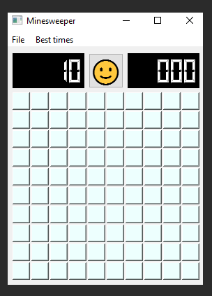

# Minesweeper

_Note:_ this project is part fun, part learning python. I made some not-exactly-best-practice choices 
just to get a better understanding of the language.

### About the game
Standard Minesweeper game with full functionality (the way I remembered them)  
Find the mines with the help of showing the number of neighboring mines.

### Features
* Right click once to mark a field as a mine. You cannot click on it as long as it is flagged.
* Right click again to mark it as question mark if you are not sure. This you can click.
* Click on any revealed field that has - supposedly - all neighboring mines flagged. In that case all neighboring fields not marked as mine will be revealed.
Beware, if you flagged the incorrect field(s) you will lose.
* Three pre-defined difficulty level: beginner, advanced, expert
* Keeping track of best times per difficulty level and the option to reset them (feature might be platform dependent, works on Windows)
